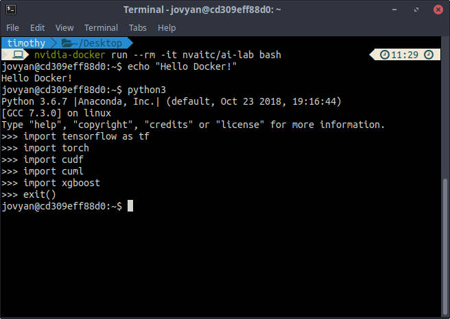
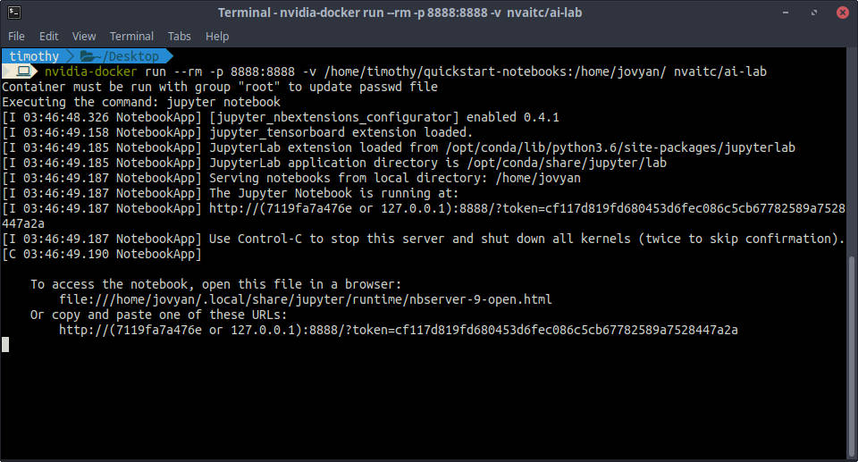
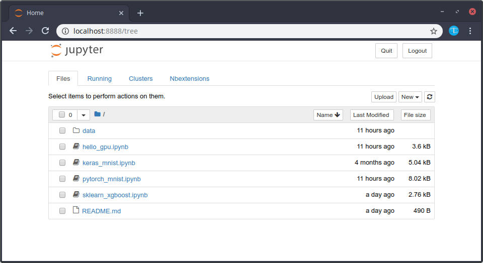
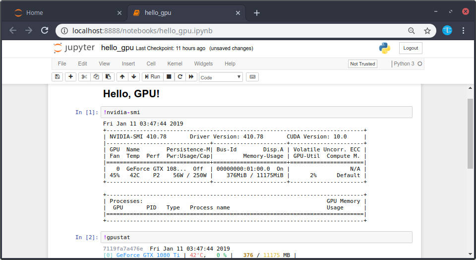
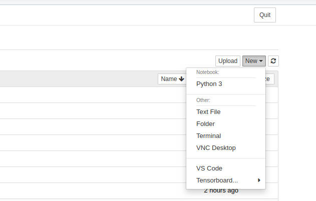
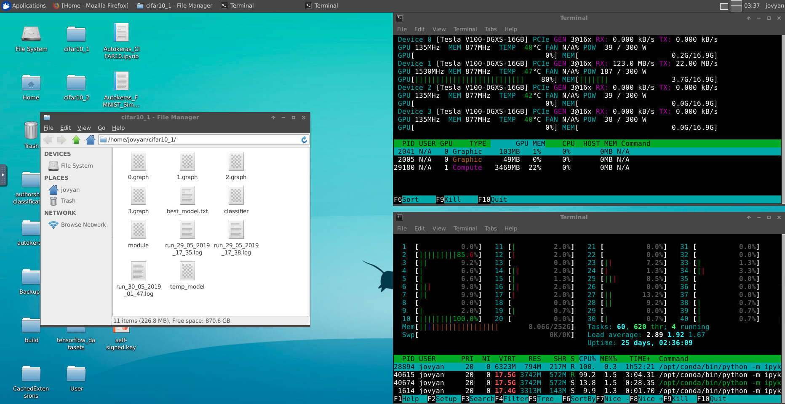
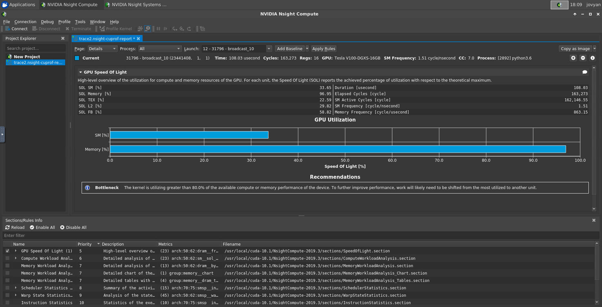
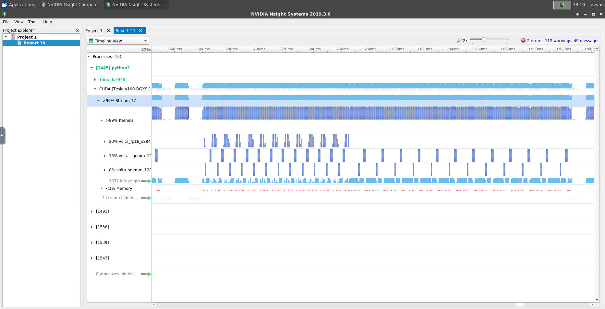

# Detailed Usage Instructions

This page will give a more detailed walkthroughs on using this image.

To begin **please make sure you have the [pre-requisites](#pre-requisites) already configured on your system**. Then, pull the latest version of the image with:

```shell
docker pull nvaitc/ai-lab:19.11
```

These instructions will apply to any workstation/server running Ubuntu 16.04 or Ubuntu 18.04 or close derivative distros.

**Contents**

* [Pre-requisites](#pre-requisites)
* [Interactive Shell (CLI)](#0-interactive-shell-cli)
* [Jupyter Notebook/Lab](#1-jupyter-notebook)
* [Virtual Desktop](#2-virtual-desktop)
* Additional Notes on specific topics
  * [Permission Issues](#permission-issues)
  * [PyTorch Dataloader](#pytorch-dataloader)
  * [Public Cloud (GCP/AWS etc.)](#public-cloud-gcp--aws-etc)
  * [Horovod](#horovod)
  * [Profiling Performance with NSight](#profiling-performance-with-nsight)

## Pre-requisites

You will need to have NVIDIA drivers>=410, Docker and the NVIDIA Container Runtime (`nvidia-docker`) installed. For a quick and dirty way to ensure this, run the following (no warranty provided, but I use this myself all the time)

```shell
sudo su root
apt install curl -y
curl https://getcuda.ml/ubuntu.sh | bash
# your system will reboot by itself
# find out more @ getcuda.ml
```

If you face problems, you may also view a [screen recording](https://www.youtube.com/watch?v=MW2AciaMGg4) of the installation process. The target machine in the recording is a remote instance running on Google Cloud.

### 0. Interactive shell (CLI)

You can use the container in interactive mode (command line interface).

```shell
nvidia-docker run --rm -it nvaitc/ai-lab:19.11 bash
```

Note that the default user in the container is always `jovyan`. ([Who is Jovyan?](https://github.com/jupyter/docker-stacks/issues/358)) 



### 1. Jupyter Notebook

We can clone our `quickstart-notebooks` repository and play around with the sample notebooks for several deep learning frameworks.

```shell
# clone the folder to /home/$USER/quickstart-notebooks
git clone https://github.com/NVAITC/quickstart-notebooks
```

Launch the container in that folder and map port 8888:

```
nvidia-docker run --rm \
 -p 8888:8888 \
 -v /home/$USER/quickstart-notebooks:/home/jovyan \
 nvaitc/ai-lab:19.11
```

**Here is a breakdown of the command**

* Base command: `nvidia-docker run nvaitc/ai-lab`
* `--rm` flag: remove after container stop
* `-p 8888:8888` : map port 8888 on container to 8888 on host
  * e.g. if you would like to map to port 80 on the host, you can use `-p 80:8888`
* `-v /home/$USER/quickstart-notebooks:/home/jovyan` : map folder `/home/$USER/quickstart-notebooks` on host to working directory of the container (`/home/jovyan`). Please note that **absolute paths** must be used, and you must mount a folder as the files in the container itself are not preserved across reboots of the container.



Copy and paste the URL on the last line into your browser (you'll need to replace the contents of the bracket with `localhost` or your IP address)



The first notebook you might want to run is the `hello_gpu.ipynb` notebook to check if you can access your GPU properly.



If you are facing problems and would like to view a screen recording of the process, please check out this [screen recording](https://www.youtube.com/watch?v=nrt5NxY5Kbw).

### 2. Virtual Desktop

For virtual desktop, you will need to pull the latest VNC version of the container image

```shell
docker pull nvaitc/ai-lab:19.11-vnc
```

Next, you will need to start the image as per normal

```shell
nvidia-docker run --rm --ipc=host \
  -p 8888:8888 \
  -v /home/$USER/work:/home/jovyan \
  nvaitc/ai-lab:19.11-vnc
```

The `--ipc=host` flag is needed for certain applications, such as Firefox, to function properly.

You will be able to access the Jupyter notebook interface at `localhost:8888` as per normal, but now under "New", you will have an additional option for "VNC Desktop". Click on that, and a new browser tab will open with your virtual desktop interface.



**Please note that first start-up can take a while!**

It might appear to freeze at a black screen. After about 1 min you will get your virtual desktop.



**Note regarding sudo password**

The default user and password is both `jovyan`.

If it matters to you, you can change the password by creating a new Docker image with the current one as the base. An example Dockerfile is as follows:

```Dockerfile
# create and build this Dockerfile

FROM nvaitc/ai-lab:19.11
LABEL maintainer="You <you@yourdomain.com>"

USER root

RUN echo "new_password\nnew_password\n" | (passwd jovyan)

# Switch back to jovyan to avoid accidental container runs as root

USER $NB_UID
```

## Additional Notes

#### Permission Issues

On some setups, you might run into permission issues as the container user (`jovyan`) will run as the first user on the system (`UID=1000`). Hence, if you face such issues, it is recommended to create a "`work`" folder with relaxed permissions and use that folder as the mount point for `/home/jovyan` in the container.

For example:

```shell
cd /home/$USER/

# create the folder
mkdir work
chmod -R 775 work

# mount folder in container
nvidia-docker run --rm -p 8888:8888 -v /home/$USER/work:/home/jovyan nvaitc/ai-lab:19.11
```

#### PyTorch DataLoader

When using PyTorch DataLoader, Docker's default shared memory allocation is too low to allow for more than a few threads, and results in killed processes. To remedy, you will need to add an additional flag (`--shm-size=1g`) to your `docker run` command to allocate 1GB of shared memory. An alternative would be to set `--ipc=host`.

The result command would look something like:

```shell
nvidia-docker run --rm \
  --shm-size=1g \
  -p 8888:8888 \
  -v /home/$USER/work:/home/jovyan \
  nvaitc/ai-lab
```

#### Public Cloud (GCP / AWS etc.)

Since Jupyter notebook uses a non-standard port (`8888` is used by default), you will need to enable network traffic to that specific port on your cloud instance. This usually involves making some changes to your cloud network/firewall settings, and the instructions vary according to your cloud provider.

**Amazon Web Services (AWS)**

* Make sure that your EC2 instance has a **security group** that allows traffic on TCP port 8888
* When creating an EC2 instance, you can create a new security group and allow traffic on TCP port 8888. Else, you can edit an existing security group as well.
* [AWS Documentation on Security Groups](https://docs.aws.amazon.com/AWSEC2/latest/UserGuide/using-network-security.html)

**Google Cloud Platform**

* Head over to the 'Firewall rules' page (sidebar: `VPC Network > Firewall rules`)
* Click `Create Firewall Rule`:
  * Name the rule (e.g. `default-allow-jupyter`)
  * Create a **target tag** (e.g. `jupyter`)
  * Under 'Protocols and ports', enable TCP port 8888
  * Click `Create` to create the firewall rule
* Ensure that your GCE instance has that specified network **target tag** (e.g. `jupyter`)
  * sometimes, you might need to restart your instance for the firewall rules to take effect
* [GCP Documentation on Using VPC Firewall Rules](https://cloud.google.com/vpc/docs/firewalls#firewall_rules_in)
* [Guide/Answer on StackOverflow](https://stackoverflow.com/a/21068402)

#### Horovod

Horovod works fine, but you should add `--privileged` flag to the docker `run command` to avoid some warning messages.

### Profiling Performance with NSight

Performance profiling can be done entirely within the Docker container with the VNC version of the container. To launch a container with the VNC desktop environment and NVIDIA Nsight profiling tools installed, you can use the following command. Note that we need to disable some security features with `--security-opt seccomp=unconfined` to enable the system calls required for the profiling operation. `--ipc=host` improves the stability of some heavy GUI applications and `--priviledged` is also recommended to be enabled if Horovod is being used.

```shell
nvidia-docker run --rm \
  --security-opt seccomp=unconfined \
  --ipc=host \
  --priviledged \
  -v /home/$USER/work:/home/jovyan \
  -p 8888:8888 \
  nvaitc/ai-lab:19.11-vnc
```

Here are some screenshots of the NVIDIA Nsight Compute and Nsight Systems profiling tools running in the virtual desktop environment. Nsight Compute is used to profile deep into individual GPU kernels, while Nsight Systems is used to profile overall performance.





