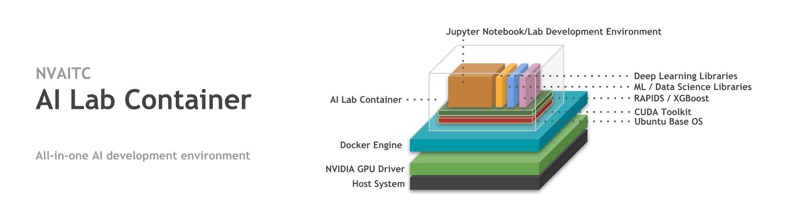
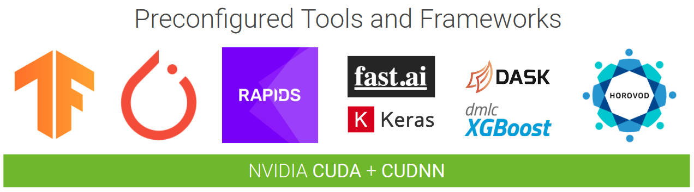
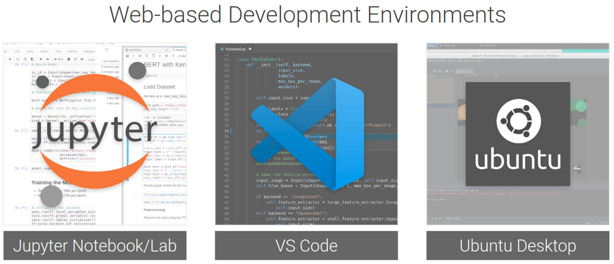

[](https://microbadger.com/images/nvaitc/ai-lab:19.11) [](https://hub.docker.com/r/nvaitc/ai-lab) [](https://microbadger.com/images/nvaitc/ai-lab:19.11-vnc) [](Issues) 

All-in-one AI development container for rapid prototyping, compatible with the nvidia-docker GPU-accelerated container runtime as well as JupyterHub. This is designed as a lighter and more portable alternative to various cloud provider "Deep Learning Virtual Machines". Get up and running with a wide range of machine learning and deep learning tasks by pulling and running the container on your workstation, on the cloud or within JupyterHub. 

## What's included?





## Using the AI Lab Container

This image can be used together with NVIDIA GPUs on workstation, servers, cloud instances. It can also be used via JupyterHub deployments as no additional ports are required things like for TensorBoard. Please note that the following instructions assume you already have the NVIDIA drivers and container runtime already installed. If not, here are some [quick instructions](INSTRUCTIONS.md#pre-requisites).

**Pulling the container**

```bash
docker pull nvaitc/ai-lab:19.11
```

**Running an interactive shell (`bash`)**

```bash
nvidia-docker run --rm -it nvaitc/ai-lab:19.11 bash
```

**Run Jupyter Notebook**

The additional command line flags define the following options:

* forward port `8888` to your host machine
* mount `/home/$USER` as the working directory (`/home/jovyan`)

```bash
nvidia-docker run --rm \
 -p 8888:8888 \
 -v /home/$USER:/home/jovyan \
 nvaitc/ai-lab:19.11
```

Run JupyterLab by setting `JUPYTER_ENABLE_LAB=yes`, or replacing `tree` with `lab` in the browser address bar

```bash
nvidia-docker run --rm \
 -p 8888:8888 \
 -v /home/$USER:/home/jovyan \
 -e JUPYTER_ENABLE_LAB=yes \
 nvaitc/ai-lab:19.11
```
**Run Batch Job**

It is also perfectly possible to run a batch job with this container, be it on a workstation or as part of a larger cluster with a scheduler that can schedule Docker containers.

```bash
nvidia-docker run --rm bash nvaitc/ai-lab:19.11 -c 'echo "Hello world!" && python3 script.py'
```

### Additional Instructions

For extended instructions, please take a look at: [INSTRUCTIONS.md](INSTRUCTIONS.md).

[INSTRUCTIONS.md](INSTRUCTIONS.md) contains full instructions and addresses common questions on [deploying to public cloud (GCP/AWS)](INSTRUCTIONS.md#public-cloud-gcp--aws-etc), as well as using [PyTorch DataLoader](INSTRUCTIONS.md#pytorch-dataloader) or troubleshooting [permission issues](INSTRUCTIONS.md#permission-issues) with some setups.

If you have any ideas or suggestions, please feel free to open an issue.

## FAQ

**1. Can I modify/build this container myself?**

Sure! The `Dockerfile` is provided in this repository. All you need is a fast internet connection and about 50 minutes of time to build this container from scratch. 

Should you only require some extra packages, you can build your own Docker image using `nvaitc/ai-lab` as the base image. For example, to add the MXNet framework into container:

```Dockerfile
# create and build this Dockerfile

FROM nvaitc/ai-lab:19.11
LABEL maintainer="You <you@yourdomain.com>"

# you need to use root user for apt-get or make install
#USER root
#RUN apt-get update && apt-get install some-package

# use notebook user for pip/conda
USER $NB_UID
RUN pip install --no-cache-dir mxnet-cu92mkl

# always switch back to notebook user at the end
USER $NB_UID
```

**2. Do you support MXNet/`some-package`?**

See **Point 1** above to see how to add MXNet/`some-package` into the container. I had chosen not to distribute MXNet/`some-package` with the container as it is less widely used and is large in size, and can be easily installed with pip since the environment is already properly configured. If you have a suggestion for a package that you would like to see added, open an issue.

**3. Do you support multi-node or multi-GPU tasks?**

Multi-GPU has been tested with Keras `multi_gpu_model` and Horovod, and it works as expected. However, I have not yet validated multi-node tasks (eg. OpenMPI and Horovod) but the packages are installed. I intend to pay more attention to this in the future.

**4. Can I get hardware accelerated GUI (OpenGL) applications?**

Yes! Be sure to pull the `vnc` version of the container e.g. `nvaitc/ai-lab:19.11-vnc` and use the "New" menu in Jupyter Notebook to launch a new **VNC Desktop**. This will allow you to use a virtual desktop interface. Next, start your application adding `vglrun` in front of the application command (e.g.  `vglrun glxgears`). You can see a video of SuperTuxKart running in the VNC desktop [here](https://www.youtube.com/watch?v=2q18cxxQuhk).

**5. How does this contrast with NGC containers?**

NVIDIA GPU Cloud ([NGC](https://www.nvidia.com/en-sg/gpu-cloud/)) features NVIDIA tuned, tested, certified, and maintained containers for deep learning and HPC frameworks that take full advantage of NVIDIA GPUs on supported systems, such as [NVIDIA DGX products](https://www.nvidia.com/en-sg/data-center/dgx-systems/). **We recommend the use of NGC containers for mission critical and production workloads.**

The AI Lab container was designed for students and researchers. The container is primarily designed to create a frictionless experience (by including all frameworks) during the initial prototyping and exploration phase, with a focus on iteration with fast feedback and less focus on deciding on specific approaches or frameworks. **This is not an official NVIDIA product!**

If you would like to use NGC containers in an AI Lab like container, there is an example of how you can build one yourself. Take a look at [`tf-amp.Dockerfile`](tf-amp.Dockerfile). Do note that you are restricted from distributing derivative images from NGC containers in a public Docker registry.

**6. What GPUs do you support?**

The container supports compute capability 6.0, 6.1, 7.0, 7.5:

* Pascal (P100, GTX 10-series)
* Volta (V100, Titan V)
* Turing (T4, RTX 20-series)

## Support

* Core Maintainer: [Timothy Liu (tlkh)](https://github.com/tlkh)
* **This is not an official NVIDIA product!**
* The website, its software and all content found on it are provided on an “as is” and “as available” basis. NVIDIA/NVAITC does not give any warranties, whether express or implied, as to the suitability or usability of the website, its software or any of its content. NVIDIA/NVAITC will not be liable for any loss, whether such loss is direct, indirect, special or consequential, suffered by any party as a result of their use of the libraries or content. Any usage of the libraries is done at the user’s own risk and the user will be solely responsible for any damage to any computer system or loss of data that results from such activities.
* Please open an issue if you encounter problems or have a feature request

**Adapted from the Jupyter Docker Stacks**

* Please visit the documentation site for help using and contributing to this image and others.
* [Jupyter Docker Stacks on ReadTheDocs](http://jupyter-docker-stacks.readthedocs.io/en/latest/index.html)
* [Selecting an Image :: Core Stacks :: jupyter/base-notebook](http://jupyter-docker-stacks.readthedocs.io/en/latest/using/selecting.html#jupyter-base-notebook)

 
