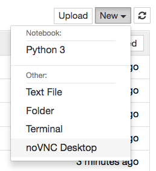

# nbnovnc

**nbnovnc** provides Jupyter server and notebook extensions to proxy a notebook-side VNC session using noVNC, enabling users to run non-web applications within their Jupyter notebook server. This is mostly useful for hosted Jupyter environments such as JupyterHub or Binder.

[](https://mybinder.org/v2/gh/ryanlovett/nbnovnc/master)



## Installation

### Install Dependencies
The extension requires [nbserverproxy](https://github.com/jupyterhub/nbserverproxy) and currently uses an opinionated VNC environment comprised of TightVNC server, noVNC, supervisord, and websockify.

On Debian/Ubuntu:
```
apt install tightvncserver novnc websockify supervisor xinit
```

#### websockify compatibility
nbnovnc requires websockify version 0.8.0 for python2. There is a bug in websockify 0.8.0 under python3 which has since been addressed in websockify master. However, nbnovnc is not yet compatible with websockify master.


### Install nbnovnc 
Install the library:
```
pip install nbnovnc
```

Either install the extensions for the user:
```
jupyter serverextension enable  --py nbnovnc
jupyter nbextension     install --py nbnovnc
jupyter nbextension     enable  --py nbnovnc
```

Or install the extensions for all users on the system:
```
jupyter serverextension enable  --py --sys-prefix nbnovnc
jupyter nbextension     install --py --sys-prefix nbnovnc
jupyter nbextension     enable  --py --sys-prefix nbnovnc
```

### Configuration

The following traitlets are available:

- NBNoVNC.geometry: The desktop geometry, e.g. 1024x768.
- NBNoVNC.depth: The color depth, e.g. 24.
- NBNoVNC.novnc_directory: The path to noVNC's web assets.
- NBNoVNC.vnc_command: The command to launch the VNC server. Contains replacement fields for display, depth, and geometry, e.g. `xinit -- /usr/bin/Xtightvnc :{display} -geometry {geometry} -depth {depth}`
- NBNoVNC.websockify_command = The websockify command. Contains replacement fields. e.g. `websockify --web {novnc_directory} --heartbeat {heartbeat} {port} localhost:{vnc_port}`

You can set these in a jupyter_notebook_config.py in one of the config paths from `jupyter --paths`. For example:
```
c.NBNoVNC.novnc_directory = "/usr/local/src/novnc"
```

You may configure the desktop environment by altering ~/.xinitrc. For example:
```
#!/bin/bash

. /etc/X11/xinit/xinitrc
```

### Security

In a shared environment where one user may freely connect to the host running another user's VNC server, you should make sure that the VNC server authenticates connections. For example, in jupyter_notebook_config.py:
```
import os
rfb_auth_file = os.path.join(os.environ['HOME'], '.vnc', 'passwd')
c.NBNoVNC.vnc_command = "xinit -- /usr/bin/Xtightvnc :{display} -geometry {geometry} -depth {depth}" + " -rfbauth " + rfb_auth_file
```
This requires that the user sets a password via `vncpasswd`.
